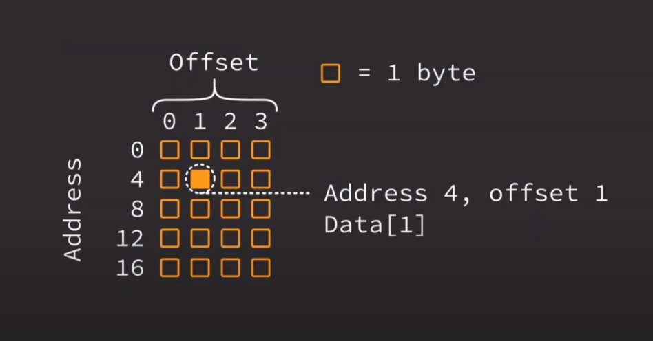

# RUST <!-- omit in toc -->

## Table of Contents: <!-- omit in toc -->

- [Fundamentals](#fundamentals)
  - [Data Types](#data-types)
    - [String and &str](#string-and-str)
      - [Strings Recap](#strings-recap)
      - [Strings Demo](#strings-demo)
  - [Variables](#variables)
  - [Functions](#functions)
  - [Println Macro](#println-macro)
  - [Control flow using `if`](#control-flow-using-if)
  - [Repetition Using Loops](#repetition-using-loops)
  - [Match](#match)
    - [Advanced `match` Demo](#advanced-match-demo)
    - [`match` vs `else..if`](#match-vs-elseif)
    - [Match Recap](#match-recap)
  - [Working With Data](#working-with-data)
    - [Enumeration `enum`](#enumeration-enum)
      - [Enums Recap](#enums-recap)
    - [Enumeration Revisited](#enumeration-revisited)
      - [Enumeration Revisited Recap](#enumeration-revisited-recap)
      - [Enumeration Revisited Demo](#enumeration-revisited-demo)
    - [Structure `struct`](#structure-struct)
      - [Structs Recap](#structs-recap)
    - [Tuples](#tuples)
      - [Tuples Recap](#tuples-recap)
    - [`Option`](#option)
      - [`Option` Recap](#option-recap)
      - [`Option` Demo](#option-demo)
    - [`Result`](#result)
      - [`Result` Recap](#result-recap)
      - [`Result` Demo](#result-demo)
  - [Expressions](#expressions)
    - [Expressions Recap](#expressions-recap)
  - [Intermediate Memory](#intermediate-memory)
    - [Addresses](#addresses)
    - [Offsets](#offsets)
    - [Intermediate Memory Recap](#intermediate-memory-recap)
  - [Ownership](#ownership)
    - [Ownership Recap](#ownership-recap)
  - [Data Structures](#data-structures)
    - [Vector](#vector)
      - [Vector Recap](#vector-recap)
      - [Vector Demo](#vector-demo)
    - [Hashmap](#hashmap)
      - [Hashmap Recap](#hashmap-recap)
      - [Hashmap Demo](#hashmap-demo)
  - [Type Annotations](#type-annotations)
    - [Type Annotations Recap](#type-annotations-recap)
  - [Extra](#extra)
    - [Basic Closures Demo](#basic-closures-demo)

# Fundamentals

## Data Types

- Boolean
- Integer
- Double & float
- Character
- String

### String and &str

- Two commonly used types of strings
  - `String` - owned
  - `&str` - borrowed `String` slice
- Must use and owned `String` to store in a `struct`
- Use `&str` when passing to a function

**Example - Pass to function:**

```rust
fn print_it(data: &str) {
    println!("{:?}", data);
}

fn main() {
    print_it("a string slice");
    let owned_string = "owned string".to_owned();
    let another_owned = String::from("another");
    print_it(&owned_string);
    print_it(&another_owned);
}
```

**Example - Will not work** ❌:

```rust
struct Employee {
    name: &str,
}

fn main() {
    let emp_name = "Jayson";
    let emp = Employee {
        name: emp_name
    };
}
```

**Example - Works!** ✅:

```rust
struct Employee {
    name: String,
}

fn main() {
    let emp_name = "Jayson".to_owned();
    let emp_name = String::from("Jayson"); // or
    let emp = Employee {
        name: emp_name
    };
}
```

#### Strings Recap

- Strings are automatically borrowed
- Use `.to_owned()` or `String::from()` to create and owned copy of a string slice
- Use and owned `String` when storing in a `struct`

#### Strings Demo

```rust
struct LineItem {
    name: String,
    count: i32,
}

fn print_name(name: &str) {
    println!("name: {:?}", name);
}

fn main() {
    let receipt = vec![
        LineItem {
            name: "cereal".to_owned(),
            count: 1,
        },
        LineItem {
            name: String::from("fruit"),
            count: 3,
        },
    ];

    for item in receipt {
        print_name(&item.name);
        println!("count: {:?}", item.count)
    }
}
```

## Variables

- Assign data to a temporary memory location
  - Allows Programmer to easily work with memory
- Immutable by default, but can be mutable

```rust
let j = 'j';
let two = 2;
let my_half = 0.5;
let mut my_name = "Angel";
let quit_program = false;
let your_half = my_half;
```

## Functions

- A way to encapsulate program functionality
- Optionally accept data
- Optionally return data
- Utilized for code organization
  - Also makes code easier to read

```rust
fn add(a: i32, b: i32) -> i32 {
    a + b
}

let x = add(1, 1);
let y = add(3, 0);
let z = add(x, 1);
```

## Println Macro

- _Prints_ (displays) information to the terminal
- Macros use an exclamation point to call
- Generate additional Rust code
- Useful for debugging

```rust
let life = 42;
println!("hello");
println!("{:?}", life);
println!("{:?} {:?}", life, life);
```

## Control flow using `if`

- Code executed line-by-line
- Actions are performed & control flow may change
  - Specific conditions can change control flow
    - `if`
    - `else`
    - `else if`

**Example `if..else`:**

```rust
let a = 99;
if a > 99 {
    println!("Big number");
} else {
    println!("Small number");
}

```

**Example Nested `if..else`:**

```rust
let a = 99;
if a > 99 {
    if a > 200 {
        println!("Huge number");
    } else {
        println!("Big number");
    }
} else {
    println!("Small number");
}
```

**Example `else..if`:**
```rust
let a = 99;
if a > 200 {
    println!("Huge number");
} else if a > 99 {
    println!("Big number");
} else {
    println!("Small number");
}
```

## Repetition Using Loops

- Called _**lopping**_ or _**iteration**_
- Multiple types of loops
  - `loop` - infinite loop
  - `while` - conditional loop

**Loop**:

```rust
let mut a = 0;
loop {
    if a == 5 {
        break;
    }
    println!("{:?}", a);
    a = a + 1;
}
```

**While loop:**

```rust
let mut a = 0;
while a != 5 {
    println!("{:?}", a);
    a = a + 1;
}
```

## Match

- Add logic to program
- Similar to `if..else`
- Exhaustive
  - All options must be accounted for

**Example with boolean:**

```rust
fn main() {
    let some_bool = true;
    match some_bool {
        true => println!("its true"),
        false => println!("its false"),
    }
}
```

**Example with int:**

```rust
fn main() {
    let some_int = 3;
    match some_int {
        1 => println!("its 1"),
        2 => println!("its 2"),
        3 => println!("its 3"),
        _ => println!("its somethings else"),
    }
}
```

### Advanced `match` Demo

```rust
enum Discount {
    Percent(i32),
    Flat(i32),
}

struct Ticket {
    event: String,
    price: i32,
}

fn main() {
    let n = 3;
    match n {
        3 => println!("three"),
        other => println!("number: {:?}", other),
    }

    let flat = Discount::Flat(2);
    match flat {
        Discount::Flat(2) => println!("flat 2"),
        Discount::Flat(amount) => println!("flat discount of {:?}", amount),
        _ => (),
    }

    let concert = Ticket {
        event: "concert".to_owned(),
        price: 50,
    };
    match concert {
        Ticket { price: 50, event } => println!("event @ 50 = {:?}", event),
        Ticket { price, .. } => println!("price = {:?}", price), // Two dots just means, any other fields get ignored
    }
}
```

### `match` vs `else..if`

- `match` will be checked by the compiler
  - If a new possibility is added, you will be notified when this occurs
- `else..if` is <ins>not</ins> checked by the compiler
  - If a new possibility is added, your code may contain a bug

### Match Recap

- Prefer `match` over `else..if` when working with a single variable
- `match` considers all possibilities
  - More robust code
- Use underscore (_) to match **anything else**

## Working With Data

### Enumeration `enum`

- Data that can be one of multiple different possibilities
  - Each possibility is called a _**variant**_
- Provides information about your program to the compiler
  - More robust programs

**Example:**

```rust
enum Direction {
    Up,
    Down,
    Left,
    Right
}

fn which_way(go: Direction) {
    match go {
        Direction::Up => "up",
        Direction::Down => "down",
        Direction::Left => "left",
        Direction::Right => "right",
    }
}
```

#### Enums Recap

- Enums can only be one variant at a time
- More robust programs when paired with `match`
- Make program code easier to read

### Enumeration Revisited

- `enum` is a type that can represent one item at a time
  - Each item is called a variant
- `enum` is not limited to just plain variants
  - Each variant can optionally contain additional data

**Example:**

```rust
enum Mouse {
    LeftClick,
    RightClick,
    MiddleClick,
    Scroll(i32),
    Move(i32, i32),
}
```

```rust
enum PromoDiscount {
    NewUser,
    Holiday(String),
}

enum Discount {
    Percent(f64),
    Flat(i32),
    Promo(PromoDiscount),
    Custom(String),
}
```

#### Enumeration Revisited Recap

- `enum` variants can optionally contain data
  - The data can be another `enum`
- Can mix plain identifiers and data-containing variants within the same `enum`
- More than one piece of data can be associated with a variant

#### Enumeration Revisited Demo

```rust
enum Message {
    ChangeColor((u8, u8, u8)),
    Echo(String),
    Move(Point),
    Quit,
}

struct Point {
    x: u8,
    y: u8,
}

struct State {
    color: (u8, u8, u8),
    position: Point,
    quit: bool,
}

impl State {
    fn change_color(&mut self, color: (u8, u8, u8)) {
        self.color = color;
    }

    fn quit(&mut self) {
        self.quit = true;
    }

    fn echo(&self, s: String) {
        println!("{}", s);
    }

    fn move_position(&mut self, p: Point) {
        self.position = p;
    }

    fn process(&mut self, message: Message) {
        match message {
            Message::ChangeColor(rgb) => self.change_color(rgb),
            Message::Echo(msg) => self.echo(msg),
            Message::Move(coordinate) => self.move_position(coordinate),
            Message::Quit => self.quit(),
            _ => (),
        }
    }
}

fn main() {
    let mut state = State {
        quit: false,
        position: Point { x: 0, y: 0},
        color: (0, 0, 0),
    }

    state.process(Message::ChangeColor((255, 0, 255)));
    state.process(Message::Echo(String::from("hello world")));
    state.process(Message::Move(Point { x: 10, y: 15 }));
    state.process(Message::Quit);
}
```

### Structure `struct`

- A type that contains multiple pieces of data
  - All or nothing - cannot have some pieces of data and not others
- Each piece of data is called a _**field**_
- Makes working with data easier
  - Similar data can be grouped together

**Example:**
```rust
struct ShippingBox {
    depth: i32,
    width: i32,
    height: i32,
}

fn main() {
    let my_box = ShippingBox {
        depth: 3,
        width: 2,
        height: 5,
    };
    let tall = my_box.height; // 5
    println!("the box is {:?} units tall", tall);
}
```

#### Structs Recap

- Structs deal with multiple pieces of data
- All fields must be present to create a `struct`
- Fields can be accessed using a dot (.)

### Tuples

- A type of "record"
- Store data anonymously
  - No need to name fields
- Useful to return paris of data from functions
- Can be "destructured" easily into variables

**Example:**

```rust
enum Access {
    Full,
}

fn one_two_three() -> (i32, i32, i32) {
    (1, 2, 3)
}

fn main() {
    let numbers = one_two_three();
    let (x, y, z) = one_two_three();
    println!("{:?}, {:?}", x, numbers.0); // 1
    println!("{:?}, {:?}", y, numbers.1); // 2
    println!("{:?}, {:?}", z, numbers.2); // 3

    let (employee, access) = ("Jake", Access::Full);
}
```

#### Tuples Recap

- Allow for anonymous data access
- Useful when destructuring
- Can contain any number of fields
  - Use `struct` when more than 2 or 3 fields

### `Option`

- A type that may be one of two things
  - Some data of a specified type
  - Nothing
- Used in scenarios where data may not be required or is unavailable
  - Unable to find something
  - Ran out of items in a list
  - Form fields not filled out

**Definition:**

```rust
enum Option<T> {
    Some(T),
    None
}
```

**Example:**

```rust
struct Customer {
    age: Option<i32>,
    email: String,
}

let mark = Customer {
    age: Some(22), email: "mark@example.com".to_owned(),
};
let becky = Customer {
    age: None, email: "becky@example.com".to_owned(),
};
match becky.age {
    Some(age) => println!("customer is {:?} years old", age),
    None => println!("customer age not provided"),
}
```

```rust
struct GroceryItem {
    name: String,
    qty: i32,
}

fn find_quantity(name: &str) -> Option<i32> {
    let groceries = vec![
        GroceryItem { name: "bananas".to_owned(), qty: 4, },
        GroceryItem { name: "eggs".to_owned(), qty: 12, },
        GroceryItem { name: "bread".to_owned(), qty: 1, },
    ];
    for item in groceries {
        if item.name == name {
            return Some(item.qty);
        }
    }
    None
}
```

#### `Option` Recap

- `Option` represents either some data or nothing
  - `Some(variable_name)`
    - Data is available
  - `None`
    - No data is available
- Useful when needing to work with optional data
- use `Option<type>` to declare an optional type

#### `Option` Demo

```rust
struct Survey {
    q1: Option<i32>,
    q2: Option<bool>,
    q3: Option<String>,
}

fn main() {
    let response = Survey {
        q1: None,
        q2: Some(true),
        q3: Some("A".to_owned()),
    };

    match response.q1 {
        Some(ans) => println!("q1: {:?}", ans),
        None => println!("q1: no response"),
    }
    match response.q2 {
        Some(ans) => println!("q2: {:?}", ans),
        None => println!("q2: no response"),
    }
    match response.q3 {
        Some(ans) => println!("q3: {:?}", ans),
        None => println!("q3: no response"),
    }
}
```

### `Result`

- A data type that contains one of two types of data:
  - _**Successful**_ data
  - _**Error**_ data
- Used in scenarios where an action needs to be taken, but has the possibility of failure
  - Copying a file
  - Connecting to a website

**Definition:**

```rust
enum Result<T, E> {
    Ok(T),
    Err(E)
}
```

**Example:**

```rust
fn get_sound(name: &str) -> Result<SoundData, String> {
    if name == "alert" {
        Ok(SoundData::new("alert")),
    } else {
        Err("unable to find sound data".to_owned())
    }
}

let sound = get_sound("alert");
match sound {
    Ok(_) => println!("sound data located"),
    Err(e) => println!("error: {:?}", e),
}
```

#### `Result` Recap

- `Result` represents either success or failure
  - `Ok(variable_name)`
    - The operation was completed
  - `Err(variable_name)`
    - The operation failed
- Useful when working with functionality that can potentially fail
- Use `Result<T,E>` when working with results

#### `Result` Demo

```rust
#[derive(Debug)]
enum MenuChoice {
    MainMenu,
    Start,
    Quit,
}

fn get_choice(input: &str) -> Result<MenuChoice, String> {
    match input {
        "mainmenu" => Ok(MenuChoice::MainMenu),
        "start" => Ok(MenuChoice::start),
        "quit" => Ok(MenuChoice::Quit),
        _ => Err("menu choice not found".to_owned()),
    }
}

fn print_choice(choice: &MenuChoice) {
    println!("choice = {:?}", choice);
}

fn pick_choice(input: &str) -> Result<(), String> {
    let choice: MenuChoice = get_choice(input)?;
    print_choice(&choice);
    Ok(())
}

fn main() {
    let choice = pick_choice("end");
    println!("choice value = {:?}", choice);
}
```

## Expressions

- Rust is an expression-based language
  - Most things are evaluated and return some value
- Expression values coalesce to a single point
  - Can be used for nesting logic

**Examples:**

```rust
let my_num = 3;
let is_lt_5 = if my_num < 5 {
    true
} else {
    false
};

// or

let is_lt_5 = my_num < 5;

```

```rust
let my_num = 3;
let message = match my_num {
    1 => "hello",
    _ => "goodbye"
}
```

```rust
enum Menu {
    Burger,
    Fries,
    Drink,
}

let paid = true;
let item = Menu::Drink;
let drink_type = "water";
let order_placed = match item {
    Menu::Drink => {
        if drink_type == "water" {
            true
        } else {
            false
        }
    }
    _ => true,
};
```

### Expressions Recap

- Expressions allow nested logic
- `if` and `match` expressions can be nested
  - Best to not use more than two or three levels

## Intermediate Memory

**Basic memory refresh:**

- Memory is stored using binary
  - Bits: _0_ or _1_
- Computer optimized for bytes
  - _1_ byte == _8_ _contiguous bits_
- Fully contiguous

### Addresses

- All data in memory has an _**address**_
  - Used to locate data
  - Always the same - only data changes
- Usually don't utilize addresses directly
  - Variables handle most of the work

### Offsets

- Items can be located at and address using an _**offset**_
- Offsets begin at 0
- Represent the number of bytes away from the original address
  - Normally deal with indexes instead



### Intermediate Memory Recap

- Memory uses addresses & offsets
- Addresses are permanent, data differs
- Offsets can be used to _**index**_ into some data

## Ownership

**Managing memory:**

- Programs must track memory
  - If they fail to do so, a _**leak**_ occurs
- Rust utilizes an _**ownership**_ model to manage memory
  - The _**owner**_ of memory is responsible for cleaning up the memory
- Memory can either be _**moved**_ or _**borrowed**_

**Example - Move ❌:**

```rust
enum Light {
    Bright,
    Dull,
}

fn display_light(light: Light) {
    match light {
        Light::Bright => println!("bright");
        Light::Dull => println!("dull");
    }
}

fn main() {
    let dull = Light:Dull;
    display_light(dull);
    display_light(dull);
}
```

**Example - Borrow :white_check_mark::**

```rust
enum Light {
    Bright,
    Dull,
}

fn display_light(light: &Light) {
    match light {
        Light::Bright => println!("bright");
        Light::Dull => println!("dull");
    }
}

fn main() {
    let dull = Light:Dull;
    display_light(&dull);
    display_light(&dull);
}
```

### Ownership Recap

- Memory must be managed in some way to present leaks
- Rust uses _**ownership**_ to accomplish memory management
  - The _**owner**_ of data must clean up the memory
  - This occurs automatically at the end of the scope
- Default behavior is to _**move**_ memory to a new owner
  - Use and ampersand _**&**_ to allow code to _**borrow**_ memory

## Data Structures

### Vector

- Multiple pieces of data
  - Must be the same type
- Used for list of information
- CAn add, remove, and traverse the entries

**Example:**

```rust
let my_numbers = vec![1, 2, 3];

let mut my_numbers = Vec::new();
my_numbers.push(1);
my_numbers.push(2);
my_numbers.push(3);
my_numbers.pop();
my_numbers.len(); // this is 2

let two = my_numbers[1];
```

```rust
let my_numbers = vec![1, 2, 3];

for num in my_numbers {
    println!("{:?}", num);
}
```

#### Vector Recap

- Vectors contain multiple pieces of similar data
- Data can be added or removed
- The `vec!` macro can be used to make vectors
- User `for..in` to iterate through items of vector

#### Vector Demo

```rust
struct Test {
    score: i32
}

fn main() {
    let my_scores = vec![
        Test { score: 90 },
        Test { score: 88 },
        Test { score: 77 },
        Test { score: 93 },
    ];

    for test in my_scores {
        println!("score = {:?}", test.score);
    }
}
```

### Hashmap

- Collection that stores data as key-value pairs
  - Data is located using the **key**
  - The data is the **value**
- Similar to definitions in a dictionary
- Very fast to retrieve data using the key

**Example: Find data**

```rust
let mut people = HashMap::new();
people.insert("Susan", 21);
people.insert("Ed", 13);
people.insert("Will", 14);
people.insert("Cathy", 22);
people.remove("Susan");

match people.get("Ed") {
    Some(age) => println!("age = {:?}", age),
    None => println!("not found"),
}
```

**Example: Iterate**

```rust
for (person, age) in people.iter() {
    println!("person = {:?}, age = {:?}¨", person, age);
}

for person in people.keys() {
    println!("person = {:?}", person);
}

for age in people.values() {
    println!("age = {:?}", age);
}
```

#### Hashmap Recap

- Store information as key-value pairs
  - **key** is used to access the **value**
- Very fast to insert & find data using they key
- Useful when you need to find information and know exactly where it is (via the key)

#### Hashmap Demo

```rust
use std::collection::HashMap;

#[derive(Debug)]
struct Contents {
    content: String,
}

fn main() {
    let mut lockers = HashMap::new();
    lockers.insert(1, Contents {content: "stuff".to_owned()});
    lockers.insert(2, Contents {content: "shirt".to_owned()});
    lockers.insert(3, Contents {content: "gym shorts".to_owned()});

    for (locker_number, content) in lockers.iter() {
        println!("number: {:?}, content: {:?}", locker_number, content);
    }
}
```

## Type Annotations

- Required for function signatures
- Types are usually inferred
- Can also be specified in code
  - Explicit type annotations

**Example - Basic:**

```rust
fn print_many(msg: &str, count: i32) { }

enum Mouse {
    LeftClick,
    RightClick,
    MiddleClick,
}

let num: i32 = 15;
let a: char = 'a';
let left_click: Mouse = Mouse::LeftClick;
```

**Example - Generics:**

```rust
let numbers: Vec<i32> = vec![1, 2, 3];
let letters: Vec<char> = vec!['a', 'b'];
let clicks: Vec<Mouse> = vec![
    Mouse::LeftClick,
    Mouse::RightClick,
    Mouse::MiddleClick,
];
```

### Type Annotations Recap

- Occasionally required if compiler cannot infer the type
  - Type annotations are mostly optional within function bodies
- Can be specified when using `let` bindings

## Extra

### Basic Closures Demo

```rust
fn add_fn(a: i32, b: i32) -> i32 {
    a + b
}

fn main() {

    let add = |a: i32, b: i32| -> i32 {
        a + b
    };
    let add = |a, b| a + b;
    let sum = add(1, 1);

}
```